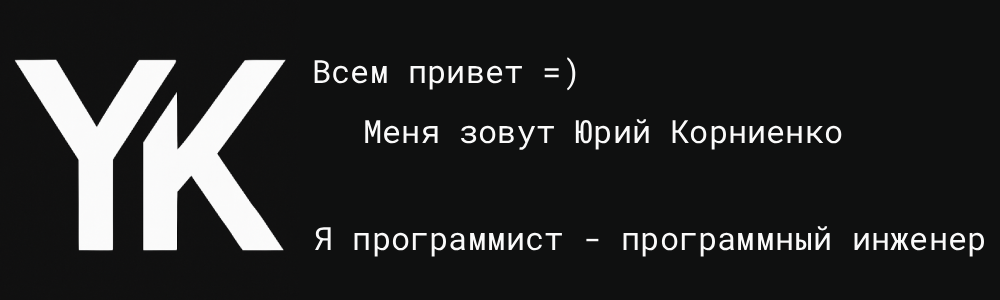

👉 [My landing site](https://yury-kornienko.pro) - here are more interesting facts about me. 👨‍💻

<table width="100%">
    <tr>
        <td align="center" width="50%">
            

                <h2>Main languages and tools
</h2>
            

            

                
                    
                
                &nbsp;&nbsp
                
                    
                
                &nbsp;&nbsp
                
                    
                
                &nbsp;&nbsp
                
                    
                
                &nbsp;&nbsp
                
                    
                
                &nbsp;&nbsp
                
                    
                
                &nbsp;&nbsp
                
                    
                
            

        </td>
        <td align="center" width="50%">
            
        </td>
    </tr>
    <tr>
        <td colspan="2">
            <h2>Briefly about me</h2>
            

                I write in different languages, worked on <b>frontend</b> on <b>JS</b>, <b>TS</b>, <b>Dart</b> and <b>Flutter</b>,
                also wrote in <b>Python</b>, <b>Go</b>, <b>Node.js</b>.
            

            

                I am deep diving into the <b>backend</b>, <b>infrastructure</b>, and <b>systems programming</b>.
            

            

                During my school and student years, I carefully studied <b>Olympiad (sports) programming</b>.
            

            

                Was a member of the <b>GDG Voronezh</b> developer community.
            

        </td>
    </tr>
    <tr>
        <td colspan="2">
            <h2>Contacts</h2>
            

                <b>Get in touch:</b>
                &nbsp;
                <a href="https://t.me/yury_kornienko_one">
                    
                    yury_kornienko_one
                </a>
                &nbsp;
                <a href="mailto:geo97it@gmail.com">
                    
                    GMail
                </a>
            

            

                <b>CV:</b>
                &nbsp;
                <a href="https://career.habr.com/yury_kornienko_one">Habr</a>
                &nbsp;
                <a href="https://orel.hh.ru/resume/688c2e57ff08aea8990039ed1f6e5653355466">HH</a>
                &nbsp;
                <a href="https://www.linkedin.com/in/yury-kornienko-one/">Linkedin</a>
            

        </td>
    </tr>
</table>

